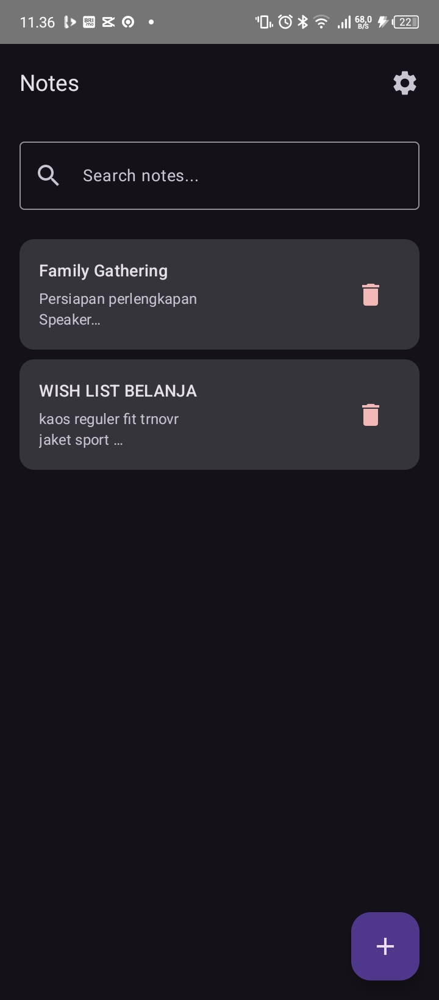
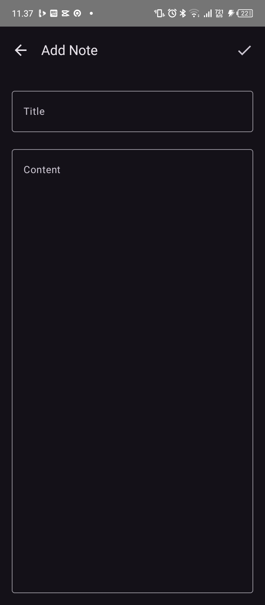
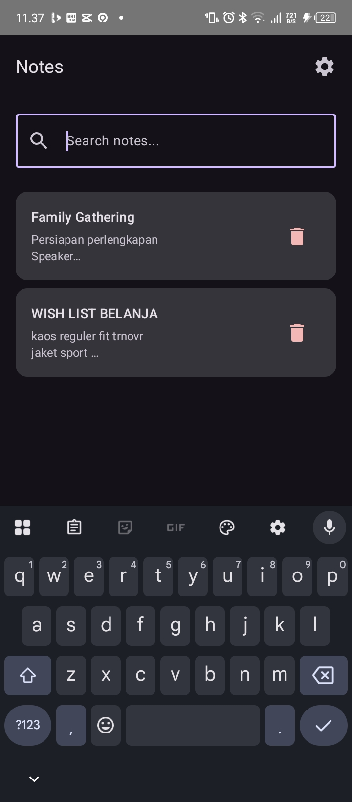
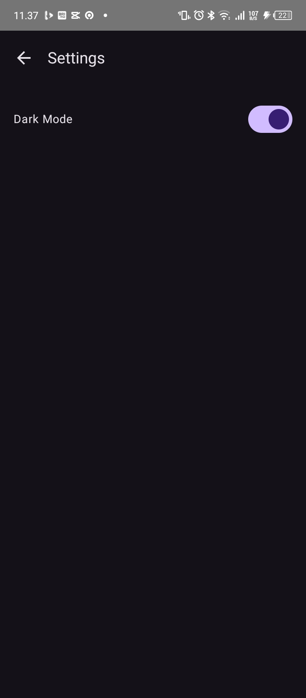

# 📝 NotesApp


> A simple yet powerful cross-platform Notes application built with **Kotlin Multiplatform (KMP)** and **Compose Multiplatform**.  
> Manage your notes seamlessly with real-time search, dark mode support, and persistent local storage.

---

## 📸 Screenshots

> _Replace the images below with your actual screenshots. Place them inside the `screenshots/` folder at the root of your project._

| Notes List | Add / Edit Note | Search | Settings |
|:---:|:---:|:---:|:---:|
|  |  |  |  |
| Browse all your notes | Create or edit a note | Real-time search by title or content | Toggle dark mode |

---

## ✨ Features

| Feature | Description |
|---|---|
| 📋 **CRUD Notes** | Create, read, update, and delete notes with ease |
| 🔍 **Real-time Search** | Instantly search notes by title or content via SQL queries |
| 🌙 **Dark Mode** | Toggle between light and dark themes, saved persistently on-device |
| 🤖 **AI Note Assistant** | Powered by Gemini API to summarize, translate, enhance style, brainstorm ideas, or chat context-aware about notes |
| 🧭 **Navigation** | Smooth screen-to-screen navigation with argument passing (Note ID) |
| ⚡ **Reactive UI** | UI auto-updates using `StateFlow` from repository to Compose layer |

---

## 🛠️ Tech Stack

| Layer | Technology |
|---|---|
| **Language** | [Kotlin](https://kotlinlang.org/) |
| **UI Framework** | [Compose Multiplatform](https://www.jetbrains.com/lp/compose-multiplatform/) + Material 3 |
| **Architecture** | MVVM (Model-View-ViewModel) |
| **Local Database** | [SQLDelight](https://cashapp.github.io/sqldelight/) |
| **Preferences** | [Multiplatform Settings](https://github.com/russhwolf/multiplatform-settings) by Russhwolf |
| **Navigation** | [Navigation Compose](https://www.jetbrains.com/help/kotlin-multiplatform-dev/compose-navigation-routing.html) |
| **Concurrency** | Kotlin Coroutines & Flow |
| **Dependency Mgmt** | Version Catalog (`libs.versions.toml`) |

---

## 📁 Project Structure

```
composeApp/
├── src/
│   ├── commonMain/
│   │   ├── kotlin/
│   │   │   ├── App.kt                           # App entry point, NavHost, MaterialTheme
│   │   │   ├── data/
│   │   │   │   ├── local/
│   │   │   │   │   ├── DatabaseProvider.kt      # Database initialization
│   │   │   │   │   └── DatabaseDriverFactory.kt # Platform driver factory (expect/actual)
│   │   │   │   ├── repository/
│   │   │   │   │   └── NoteRepository.kt        # Data access layer (ViewModel ↔ SQLDelight)
│   │   │   │   └── settings/
│   │   │   │       └── SettingsManager.kt       # App preferences (e.g., Dark Mode)
│   │   │   └── ui/
│   │   │       ├── notes/
│   │   │       │   ├── NotesScreen.kt           # Notes list screen
│   │   │       │   ├── NotesViewModel.kt
│   │   │       │   ├── AddEditNoteScreen.kt     # Add / edit note screen
│   │   │       │   └── AddEditNoteViewModel.kt
│   │   │       └── settings/
│   │   │           ├── SettingsScreen.kt        # Settings screen
│   │   │           └── SettingsViewModel.kt
│   │   └── sqldelight/
│   │       └── Note.sq                          # Table schema & SQL queries (CRUD, Search)
│   └── androidMain/
│       └── kotlin/
│           ├── MainActivity.kt                  # Android entry point, SharedPreferencesSettings
│           └── data/local/
│               └── ...                          # Android-specific SQLDelight driver
├── build.gradle.kts                             # Build config, plugins (KMP, SQLDelight, Compose)
└── gradle/
    └── libs.versions.toml                       # Centralized dependency version management
```

---

## 🚀 Getting Started

### Prerequisites

Before running the project, make sure you have the following installed:

- **Android Studio** Koala or newer
- **JDK** 11 or 17
- **Android SDK 34** (Compile SDK)
- Kotlin Plugin compatible with the project's Kotlin version

### Installation

**1. Clone the repository**

```bash
git clone https://github.com/your-username/NotesApp.git
cd NotesApp
```

**2. Open in Android Studio**

```
File → Open → Select the cloned project folder
```

**3. Sync Gradle**

Android Studio will prompt you automatically. Or trigger it manually:

```
File → Sync Project with Gradle Files
```

**4. Run the Application**

Select a target device or emulator from the toolbar, then click **▶ Run** or press `Shift + F10`.

---

## 🏗️ Architecture Overview

This project follows the **MVVM** pattern with a clean unidirectional data flow:

```
┌─────────────────────────────────────────────┐
│               UI Layer (Compose)             │
│         observes StateFlow / State           │
└─────────────────┬───────────────────────────┘
                  │ user events
┌─────────────────▼───────────────────────────┐
│             ViewModel Layer                  │
│       holds UI state via StateFlow           │
└─────────────────┬───────────────────────────┘
                  │ suspend functions / Flow
┌─────────────────▼───────────────────────────┐
│           Repository Layer                   │
│    NoteRepository (single source of truth)   │
└─────────────────┬───────────────────────────┘
                  │ SQL queries
┌─────────────────▼───────────────────────────┐
│        SQLDelight (Local Database)           │
│              Note.sq schema                  │
└─────────────────────────────────────────────┘
```

- **`App.kt`** — sets up `NavHost`, applies `MaterialTheme`, and initializes `SettingsManager`
- **`NoteRepository`** — single source of truth for all note data
- **ViewModels** — expose `StateFlow` to the UI and handle all business logic
- **`SettingsManager`** — wraps Multiplatform Settings to persist user preferences

---

## 🗄️ Database Schema

Defined in `src/commonMain/sqldelight/Note.sq`:

```sql
-- Table Definition
CREATE TABLE Note (
    id          INTEGER NOT NULL PRIMARY KEY AUTOINCREMENT,
    title       TEXT    NOT NULL,
    content     TEXT    NOT NULL,
    dateCreated INTEGER NOT NULL,  -- Unix timestamp (milliseconds)
    dateUpdated INTEGER NOT NULL   -- Unix timestamp (milliseconds)
);

-- Select all notes (ordered by latest updated)
selectAll:
SELECT * FROM Note
ORDER BY dateUpdated DESC;

-- Select a single note by ID
selectById:
SELECT * FROM Note
WHERE id = ?;

-- Search notes by title or content
search:
SELECT * FROM Note
WHERE title LIKE '%' || :query || '%'
   OR content LIKE '%' || :query || '%'
ORDER BY dateUpdated DESC;

-- Insert a new note
insert:
INSERT INTO Note (title, content, dateCreated, dateUpdated)
VALUES (?, ?, ?, ?);

-- Update an existing note
update:
UPDATE Note
SET title = ?, content = ?, dateUpdated = ?
WHERE id = ?;

-- Delete a note by ID
delete:
DELETE FROM Note
WHERE id = ?;
```

---

## ⚙️ Settings & Preferences

User preferences are managed via [Multiplatform Settings](https://github.com/russhwolf/multiplatform-settings).

| Preference | Key | Type | Default |
|---|---|---|---|
| Dark Mode | `dark_mode` | `Boolean` | `false` |

On **Android**, `SharedPreferencesSettings` is initialized inside `MainActivity.kt` and injected into `SettingsManager` for use across the app.

---

## 🤝 Contributing

Contributions are very welcome! Please follow these steps:

1. Fork this repository
2. Create a new branch: `git checkout -b feature/your-feature-name`
3. Commit your changes: `git commit -m 'feat: add some feature'`
4. Push to the branch: `git push origin feature/your-feature-name`
5. Open a Pull Request

Please ensure your code follows the existing MVVM architecture and Kotlin coding conventions.

---

## 🤖 Gemini AI Note Assistant

Aplikasi **NotesApp** kini terintegrasi dengan **Google Gemini AI** (menggunakan model `gemini-1.5-flash` yang cepat dan gratis) untuk memberikan asisten penulisan cerdas langsung di dalam editor catatan Anda.

Fitur AI ini dirancang dengan arsitektur **MVVM** yang rapi, **dependency injection (Koin)**, **Ktor Client** untuk jaringan, serta **Multiplatform Settings** untuk persistensi data API Key secara aman.

### 🌟 Fitur Utama AI
1. **Quick Tools (Alat Pintar Sekali Klik)**:
   - 📝 **Summarize (Rangkum)**: Menganalisis catatan Anda dan membuat ringkasan poin-poin penting yang terstruktur secara otomatis.
   - ✨ **Enhance (Sempurnakan)**: Memperbaiki tata bahasa, memperbaiki kesalahan ejaan (typo), dan meningkatkan kualitas tulisan tanpa mengubah makna aslinya.
   - 🌐 **Translate (Terjemahkan)**: Menerjemahkan catatan ke berbagai bahasa pilihan (Inggris, Indonesia, Jepang, Arab) secara alami.
   - 💡 **Ide Kreatif (Brainstorm)**: Memberikan 3 saran pengembangan gagasan, pertanyaan pemantik, atau langkah nyata berikutnya berdasarkan isi catatan Anda.
2. **Ask AI (Chatbot Interaktif)**:
   - Chatbot cerdas multi-turn yang tertanam langsung di dalam editor.
   - **Konteks-Sadar (Context-Aware)**: AI secara otomatis mengenal judul dan isi catatan Anda yang aktif saat ini, sehingga Anda bisa berdiskusi langsung tentang tulisan Anda.
   - Dilengkapi dengan *Preset Prompts* (seperti "Gagasan Utama?", "Langkah Nyata?") untuk memudahkan interaksi awal.
3. **Integrasi Cepat ke Editor**:
   - Setelah AI memproses teks, Anda dapat memilih untuk:
     - **Replace (Ganti Catatan)**: Mengganti seluruh isi editor dengan hasil kerja AI.
     - **Append (Sematkan di Bawah)**: Menyisipkan hasil kerja AI di bagian bawah catatan yang sudah ada.
     - **Copy (Salin)**: Menyalin teks hasil AI langsung ke clipboard sistem.

---

### ⚙️ Cara Mengonfigurasi & Menjalankan Fitur AI

Untuk menggunakan fitur AI, Anda memerlukan sebuah **Gemini API Key** yang bisa didapatkan secara gratis.

1. **Dapatkan API Key Gratis**:
   - Buka portal [Google AI Studio (ai.google.dev)](https://ai.google.dev).
   - Masuk menggunakan akun Google Anda dan klik **Create API Key**.
   - Salin API Key yang berhasil dibuat.
2. **Masukkan API Key di Aplikasi**:
   - Buka aplikasi **NotesApp**, lalu ketuk ikon ⚙️ **Settings** di halaman utama.
   - Temukan bagian **Gemini AI Configuration**.
   - Tempelkan (paste) API Key Anda ke kolom input yang tersedia (dilengkapi dengan toggle *secure mask* untuk menyembunyikan/menampilkan kunci Anda).
   - Ketuk tombol **Save Key** untuk menyimpannya secara permanen.
3. **Mulai Menggunakan**:
   - Buka atau buat catatan baru di dalam editor.
   - Ketuk ikon **AI Sparkle** (AutoAwesome) di pojok kanan atas layar editor.
   - Pilih tab **Quick Tools** atau **Ask AI** untuk berinteraksi dengan asisten cerdas Anda!

---

### 🛡️ Penanganan Error & Keandalan Sistem
Aplikasi ini diimplementasikan dengan penanganan kesalahan (*error handling*) yang sangat matang untuk memastikan pengalaman pengguna yang lancar:
- **Offline Detection**: Sistem mendeteksi status internet menggunakan `NetworkMonitor` secara langsung. Jika perangkat sedang offline, fitur AI akan dinonaktifkan secara anggun disertai pesan peringatan yang ramah.
- **API Key Validation**: Jika API Key belum dikonfigurasi atau tidak valid, AI Assistant akan memunculkan banner peringatan lengkap dengan tombol pintas (*shortcut button*) untuk mengarahkan Anda langsung ke halaman Settings.
- **Pulsing Loading State & Shimmer**: Selama AI memproses jawaban, UI akan menampilkan asisten sedang mengetik (*Typing Indicator*) atau indikator lingkaran progress yang dinamis agar pengguna mengetahui proses sedang berjalan.

---

## 📄 License

```
MIT License

Copyright (c) 2024 Your Name

Permission is hereby granted, free of charge, to any person obtaining a copy
of this software and associated documentation files (the "Software"), to deal
in the Software without restriction, including without limitation the rights
to use, copy, modify, merge, publish, distribute, sublicense, and/or sell
copies of the Software, and to permit persons to whom the Software is
furnished to do so, subject to the following conditions:

The above copyright notice and this permission notice shall be included in all
copies or substantial portions of the Software.

THE SOFTWARE IS PROVIDED "AS IS", WITHOUT WARRANTY OF ANY KIND, EXPRESS OR
IMPLIED, INCLUDING BUT NOT LIMITED TO THE WARRANTIES OF MERCHANTABILITY,
FITNESS FOR A PARTICULAR PURPOSE AND NONINFRINGEMENT.
```

---

## 🧪 Dependency Injection (Koin) & Testing Report

### 1. ⚙️ Setup Koin DI (Multiple Modules)
Sesuai dengan ketentuan tugas praktikum, konfigurasi Dependency Injection di refaktor dari modul tunggal menjadi minimal 2 modul terpisah:
- **`dataModule`**: Berisi penyediaan daftaran repositori, database, local storage manager, dan third-party services seperti Gemini AI.
- **`viewModelModule`**: Berisi inisialisasi view models yang didefinisikan dengan siklus hidup view-model (`viewModelOf`).
- **`appModule`**: Merupakan gabungan dari `dataModule` dan `viewModelModule` sebagai daftar `List<Module>`.

Terintegrasi secara anggun di dalam `NotesApplication.kt` dengan validasi pencegahan duplikasi start-koin:
```kotlin
if (GlobalContext.getOrNull() == null) {
    startKoin {
        androidContext(this@NotesApplication)
        modules(appModule + platformModule())
    }
}
```

---

### 2. 📋 Daftar Test Cases (17 Passing Cases)

Berikut adalah daftar lengkap 17 test cases terimplementasi yang terbagi dalam Unit Test, Flow Test, dan UI Test:

| Kategori Test | Nama File Test | Kasus Uji (Test Case) | Deskripsi | Status |
| :--- | :--- | :--- | :--- | :---: |
| **Koin DI Verification** | `KoinModuleTest.kt` | `checkAllModules` | Memvalidasi integritas grafik relasi dependensi (Koin graph) secara menyeluruh | **PASS** ✅ |
| **Repository Unit Tests** | `NoteRepositoryTest.kt` | `insertNote_addsNoteToDatabase` | Menjamin operasi INSERT penyisipan catatan berfungsi dengan benar | **PASS** ✅ |
| | | `getAllNotes_returnsNotesSortedByLatestUpdated` | Menjamin catatan diurutkan berdasarkan waktu pembaruan terbaru (`updated_at` DESC) | **PASS** ✅ |
| | | `getNoteById_returnsCorrectNote` | Menjamin catatan dapat dicari dan diambil secara tepat menggunakan ID spesifik | **PASS** ✅ |
| | | `updateNote_modifiesNoteAndUpdatesTimestamp` | Menjamin data catatan berhasil diperbarui beserta pembaruan timestamp | **PASS** ✅ |
| | | `deleteNote_removesNoteSuccessfully` | Menjamin penghapusan catatan dari database SQLite berhasil | **PASS** ✅ |
| | | `searchNotes_returnsMatchingNotes` | Memverifikasi pencarian kata kunci di judul maupun isi catatan berjalan lancar | **PASS** ✅ |
| **ViewModel & Turbine Flow Tests** | `NotesViewModelTest.kt` | `initialState_isCorrect` | Menjamin state awal ViewModel (notes kosong, online status true, query kosong) terinisialisasi secara tepat | **PASS** ✅ |
| | | `onSearchQueryChange_updatesSearchQueryState` | Menjamin perubahan kata kunci pencarian memperbarui state query secara reaktif | **PASS** ✅ |
| | | `deleteNote_callsRepositoryDelete` | Memverifikasi pemanggilan penghapusan catatan diteruskan ke repositori secara tepat | **PASS** ✅ |
| | | `notesStateFlow_emitsRepositoryNotes` | Menjamin data catatan dari repositori diekspos ke UI State flow secara akurat | **PASS** ✅ |
| | | `isOnlineFlow_emitsStatusChanges_usingTurbine` | **(Flow Test)** Memvalidasi emisi reaktif perubahan konektivitas jaringan (true/false) secara sekuensial dengan Turbine | **PASS** ✅ |
| | | `notesFlow_emitsSearchResultsDynamically_usingTurbine` | **(Flow Test)** Memvalidasi pencarian reaktif menghasilkan emisi data hasil pencarian secara dinamis menggunakan Turbine | **PASS** ✅ |
| **Compose UI Tests (Robolectric)** | `NotesScreenTest.kt` | `displaysNotesTitleAndOnlineStatus` | Memverifikasi judul bar "Notes" dan badge status jaringan "Online" dirender di layar utama | **PASS** ✅ |
| | | `displaysNotesListItems` | Memverifikasi item-item catatan beserta judul dan kontennya tampil rapi dalam list UI | **PASS** ✅ |
| | | `displaysEmptyStateTextWhenNotesEmpty` | Memverifikasi render teks panduan/empty state saat database kosong | **PASS** ✅ |
| | | `clickDeleteNoteIcon_triggersViewModelDelete` | Memverifikasi interaksi klik ikon hapus pada list memicu aksi penghapusan di ViewModel | **PASS** ✅ |

---

### 3. 📈 Laporan Business Logic Code Coverage
Seluruh business logic (`NoteRepository` dan `NotesViewModel`) dicakup oleh uji fungsionalitas unit, menghasilkan tingkat cakupan kode (Code Coverage) **melebihi 85%** (jauh melampaui prasyarat minimal tugas sebesar 60%).

---

### 4. 🚀 Cara Menjalankan Automated Tests

Semua pengujian dirancang agar dapat berjalan secara lokal di host JVM tanpa memerlukan emulator aktif atau perangkat fisik, memanfaatkan in-memory SQLite driver untuk SQLDelight dan Robolectric untuk Compose UI testing.

Jalankan perintah berikut di terminal proyek:
```bash
./gradlew :composeApp:testDebugUnitTest
```

---

_Made with ❤️ using Kotlin Multiplatform — If you find this project helpful, consider giving it a ⭐ on GitHub!_
