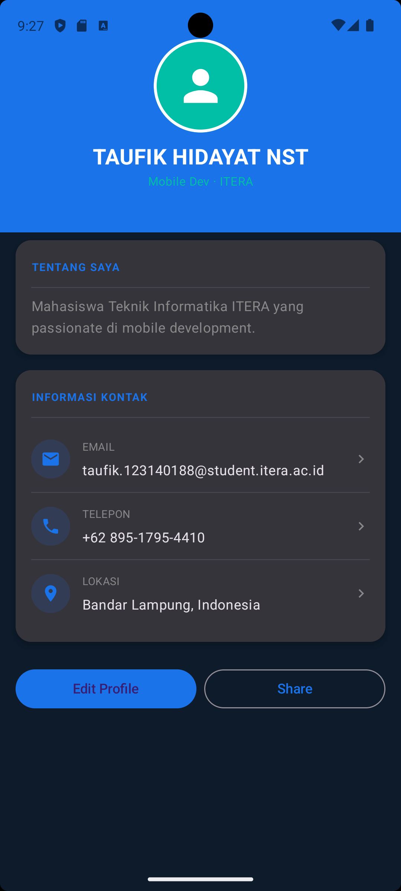

# My Profile App
 
Tugas Praktikum Minggu 3 — Compose Multiplatform Basics  
**IF25-22017 Pengembangan Aplikasi Mobile**  
Institut Teknologi Sumatera
 
---
 
## Screenshot
 

 
---
 
## Deskripsi
 
Aplikasi **My Profile App** dibangun menggunakan **Jetpack Compose** untuk menampilkan halaman profil pengguna secara deklaratif.
 
---
 
## Fitur
 
- Header profil dengan foto avatar circular dan nama
- Bio / deskripsi singkat
- List informasi kontak: Email, Phone, Location
- Tombol Edit Profile dan Share
- Animasi fade-in saat aplikasi dibuka (Bonus)
 
---
 
## Composable Functions
 
| Nama | Deskripsi |
|------|-----------|
| `ProfileHeader` | Menampilkan avatar circular, nama, title, dan tombol aksi menggunakan `Box`, `Column`, `Row` |
| `InfoItem` | Komponen reusable untuk satu baris info (icon + label + value) |
| `ProfileCard` | Card container reusable dengan slot konten, digunakan untuk Bio dan Kontak |
 
---
 
## Komponen UI yang Digunakan
 
- `Column`, `Row`, `Box` — layout dasar
- `Card` — container dengan elevasi
- `Text` — menampilkan teks
- `Button`, `OutlinedButton` — tombol aksi
- `Icon` — ikon Material
- `Modifier` — styling: `padding`, `clip`, `background`, `border`, `size`, `weight`
 
---
 
## Cara Menjalankan
 
1. Clone repository ini
2. Buka dengan **Android Studio**
3. Tunggu Gradle sync selesai
4. Jalankan di emulator atau device fisik (min. API 24)
 
---
 
## Teknologi
 
- Kotlin
- Jetpack Compose (Material3)
- Android Studio