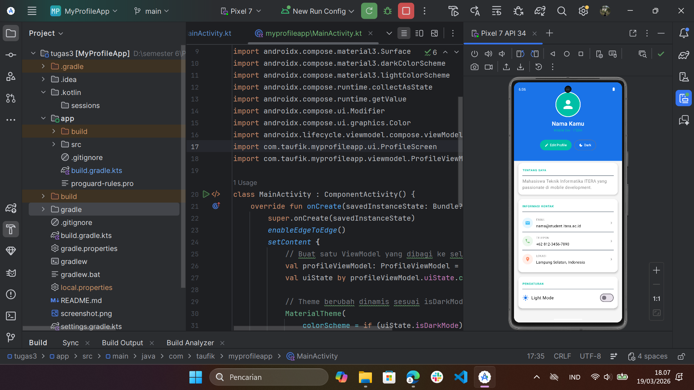
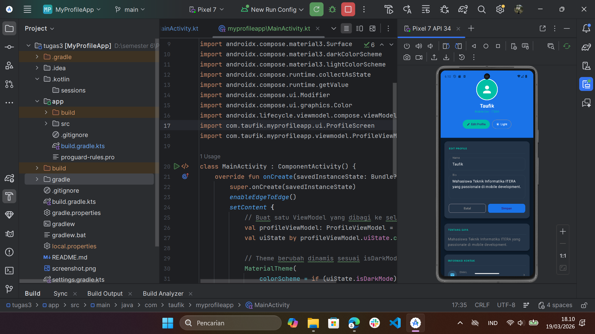
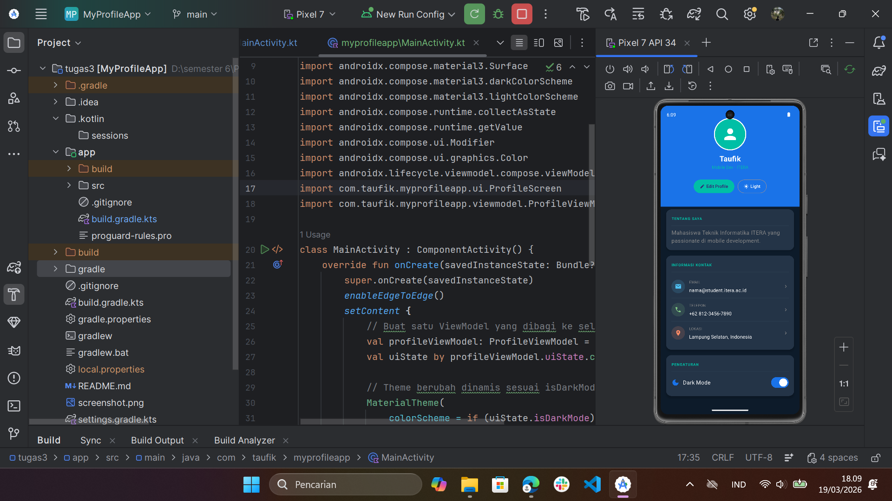
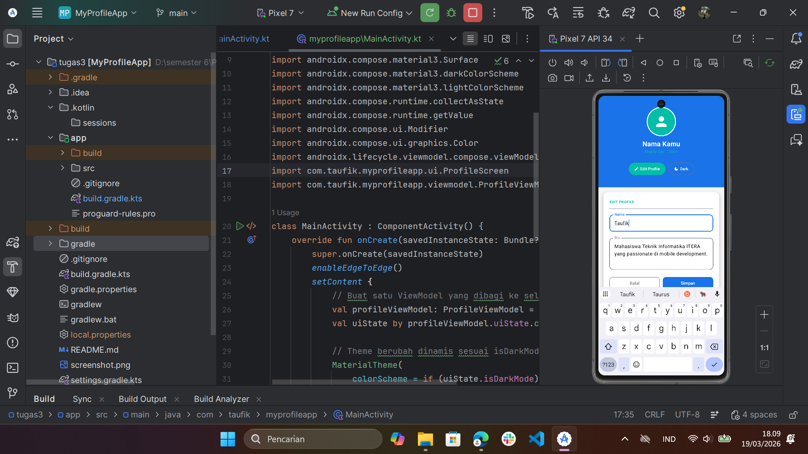

# Tugas Praktikum 4 — State Management & MVVM

**IF25-22017 Pengembangan Aplikasi Mobile**  
Institut Teknologi Sumatera

---

## Screenshot

| Profile View | Edit Profile |
|:---:|:---:|
|  |  |

| Dark Mode | Light Mode |
|:---:|:---:|
|  |  |

---

## Deskripsi

Pengembangan dari **Tugas 3 (Profile App)** dengan menambahkan MVVM architecture pattern, fitur edit profile, dan dark mode toggle menggunakan Jetpack Compose.

---

## Fitur Baru

- MVVM pattern dengan `ProfileViewModel` dan `StateFlow`
- Fitur Edit Profile (nama dan bio) dengan state hoisting
- Dark Mode / Light Mode toggle yang tersimpan di ViewModel
- Animasi transisi saat form edit muncul/hilang

---

## Struktur Folder

```
tugas4/
├── data/
│   └── ProfileUiState.kt       ← Data class UI state
├── viewmodel/
│   └── ProfileViewModel.kt     ← ViewModel dengan StateFlow
├── ui/
│   ├── ProfileComponents.kt    ← Composable reusable
│   └── ProfileScreen.kt        ← Layar utama
└── MainActivity.kt
```

---

## Arsitektur MVVM

```
ProfileUiState (data)
       ↓
ProfileViewModel (viewmodel)
  - uiState: StateFlow
  - toggleDarkMode()
  - saveProfile()
  - openEditMode() / closeEditMode()
       ↓
ProfileScreen + ProfileComponents (ui)
  - collectAsState()
  - State hoisting pada EditProfileForm
```

---

## Composable Functions

| Nama | Deskripsi |
|------|-----------|
| `ProfileHeader` | Avatar, nama, title, tombol Edit & Dark Mode |
| `InfoItem` | Baris info reusable (icon + label + value) |
| `ProfileCard` | Card container dengan slot konten |
| `LabeledTextField` | Stateless TextField — state di-hoist ke parent |
| `EditProfileForm` | Form edit nama dan bio, callback ke ViewModel |

---

## State Hoisting

`LabeledTextField` adalah contoh stateless composable — tidak menyimpan state sendiri, state sepenuhnya dikelola oleh parent:

```kotlin
LabeledTextField(
    label = "Nama",
    value = nameInput,              // state dari parent
    onValueChange = { nameInput = it } // callback ke parent
)
```

---

## Cara Menjalankan

1. Clone repository ini
2. Buka folder `tugas4` dengan Android Studio
3. Tunggu Gradle sync selesai
4. Jalankan di emulator atau device (min. API 24)

---

## Teknologi

- Kotlin
- Jetpack Compose (Material3)
- ViewModel + StateFlow
- Android Studio