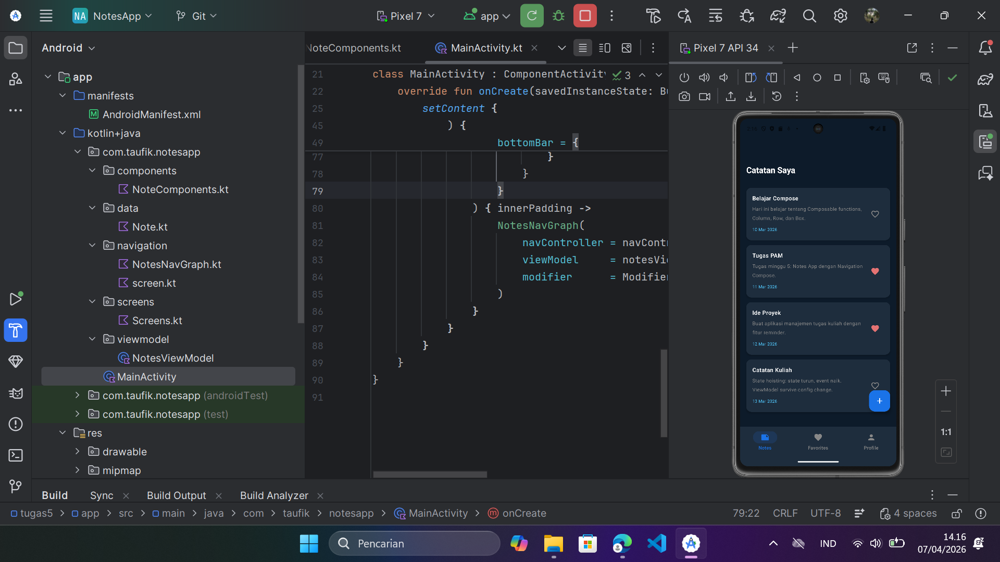
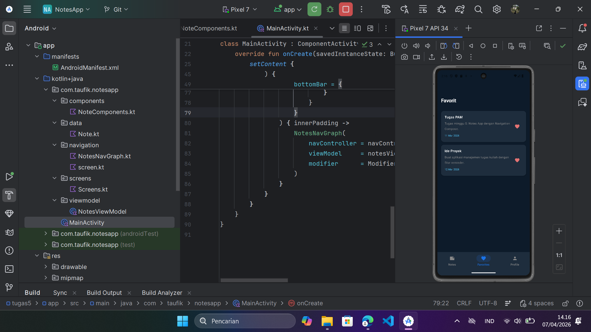
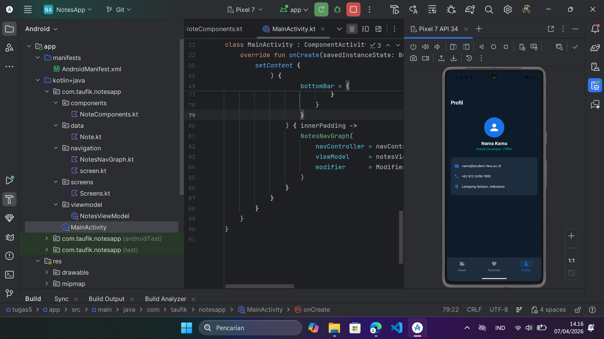

# Tugas Praktikum 5 — Navigasi Antar Layar

**IF25-22017 Pengembangan Aplikasi Mobile**  
Institut Teknologi Sumatera

---

## Screenshot

| Notes | Favorites | Profile |
|:---:|:---:|:---:|
|  |  |  |

---

## Navigation Flow Diagram

```
┌─────────────────────────────────────────────────────┐
│                  Bottom Navigation                   │
│         [Notes]      [Favorites]      [Profile]      │
└────┬──────────────────────┬──────────────────────────┘
     │                      │
     ▼                      ▼
NoteListScreen         FavoritesScreen          ProfileTabScreen
     │                      │
     │ tap note              │ tap note
     │                      │
     ▼                      ▼
NoteDetailScreen ◄────────────
     │
     ├── [Edit] ──────► EditNoteScreen
     │                       │
     │                  [Simpan / Back]
     │                       │
     └───────────────────────┘
                             ▼
                       popBackStack()

[FAB +] ──► AddNoteScreen
                 │
           [Simpan / Back]
                 │
                 ▼
           popBackStack()
```

---

## Deskripsi

Notes App dengan navigasi lengkap menggunakan **Navigation Compose**. Menerapkan MVVM pattern, passing argument antar screen, dan Bottom Navigation dengan 3 tab.

---

## Fitur

- Bottom Navigation 3 tab: Notes, Favorites, Profile
- Daftar semua catatan di tab Notes
- Filter catatan favorit di tab Favorites
- FAB untuk menambah catatan baru
- Tap catatan → Note Detail screen
- Edit catatan dengan passing `noteId` sebagai argument
- Toggle favorite dari list maupun detail screen
- Back navigation proper dari semua screen
- Bottom nav hanya muncul di 3 tab utama

---

## Struktur Folder

```
app/src/main/java/com/taufik/notesapp/
├── data/
│   └── Note.kt              ← Data class Note & NotesUiState
├── viewmodel/
│   └── NotesViewModel.kt    ← StateFlow, CRUD operations
├── navigation/
│   ├── Screen.kt            ← Sealed class semua route
│   └── NotesNavGraph.kt     ← NavHost & composable destinations
├── screens/
│   └── Screens.kt           ← NoteList, Favorites, Detail,
│                               Add, Edit, Profile screens
├── components/
│   └── NoteComponents.kt    ← NoteCard, NotesTopBar (reusable)
└── MainActivity.kt          ← Scaffold + Bottom Navigation
```

---

## Navigasi dengan Argument

`noteId` dikirim lewat route URL dan dibaca dari `backStackEntry`:

```kotlin
// Kirim argument
navController.navigate("note_detail/$noteId")

// Terima di NavGraph
composable(
    route = "note_detail/{noteId}",
    arguments = listOf(navArgument("noteId") { type = NavType.IntType })
) { backStackEntry ->
    val noteId = backStackEntry.arguments?.getInt("noteId")
}
```

---

## Cara Menjalankan

1. Clone repository, buka folder `tugas5` di Android Studio
2. Pastikan dependency sudah ada di `build.gradle.kts`:
   ```kotlin
   implementation("androidx.navigation:navigation-compose:2.7.7")
   ```
3. Sync Gradle → Run di emulator (min. API 24)

---

## Teknologi

- Kotlin
- Jetpack Compose (Material3)
- Navigation Compose
- ViewModel + StateFlow
- Android Studio
