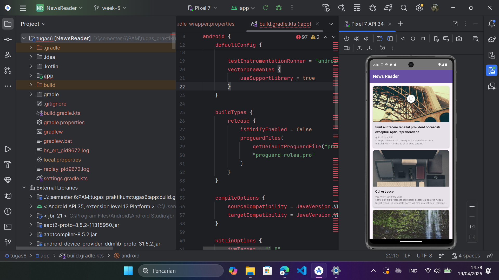
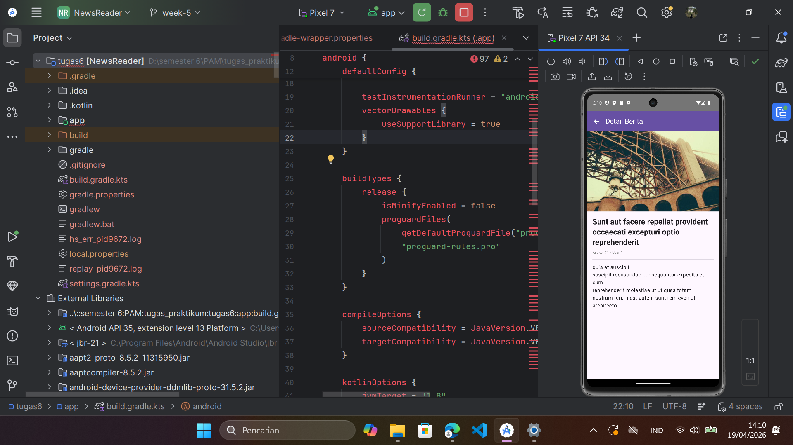
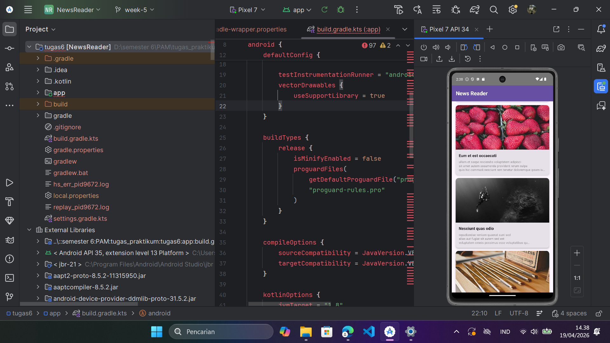
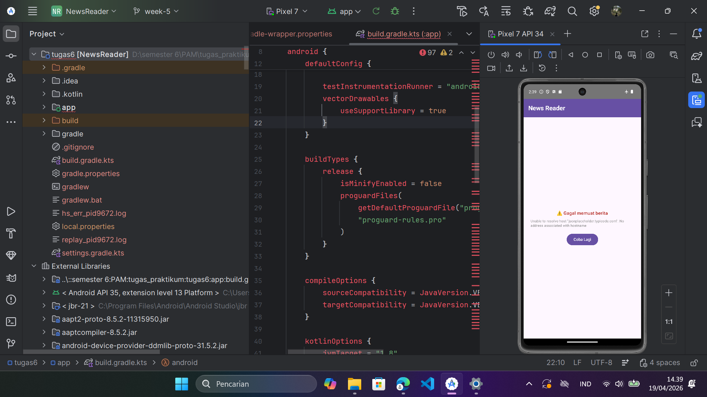

# 📱 Tugas Praktikum Minggu 6 — News Reader App

> **Mata Kuliah:** Pengembangan Aplikasi Mobile  
> **Program Studi:** Teknik Informatika  
> **Institusi:** Institut Teknologi Sumatera (ITERA)  
> **Tahun Akademik:** Genap 2025/2026

---

## 👤 Biodata Mahasiswa

| Keterangan | Detail |
|---|---|
| **Nama** | Taufik Hidayat NST |
| **NIM** | 123140188 |
| **Program Studi** | Teknik Informatika |
| **Institusi** | Institut Teknologi Sumatera |
| **Mata Kuliah** | Pengembangan Aplikasi Mobile |
| **Pertemuan** | 6 — Networking dan REST API |

---

## 📋 Deskripsi Tugas

Membuat aplikasi **News Reader** menggunakan Kotlin + Jetpack Compose yang mengintegrasikan REST API dengan fitur:

- ✅ Fetch data artikel dari public REST API menggunakan **Ktor Client**
- ✅ Menampilkan list artikel dengan title, deskripsi, dan gambar
- ✅ Detail screen saat artikel diklik
- ✅ Pull to Refresh functionality
- ✅ Loading, Success, dan Error states
- ✅ Repository Pattern untuk API calls

---

## 🌐 API yang Digunakan

### 1. JSONPlaceholder — Data Artikel
| | |
|---|---|
| **URL** | https://jsonplaceholder.typicode.com |
| **Endpoint** | `GET /posts` — Mengambil semua artikel |
| **Endpoint** | `GET /posts/{id}` — Mengambil artikel berdasarkan ID |
| **Format** | JSON |
| **Auth** | Tidak diperlukan (public API) |

Contoh response dari `GET /posts/1`:
```json
{
  "userId": 1,
  "id": 1,
  "title": "sunt aut facere repellat provident occaecati excepturi optio reprehenderit",
  "body": "quia et suscipit\nsuscipit recusandae consequuntur expedita..."
}
```

### 2. Picsum Photos — Gambar Placeholder
| | |
|---|---|
| **URL** | https://picsum.photos |
| **Endpoint** | `GET /seed/{id}/600/400` — Gambar unik per artikel |
| **Format** | JPEG |
| **Auth** | Tidak diperlukan (public API) |

---

## 🏗️ Arsitektur & Teknologi

### Tech Stack
| Komponen | Library / Tool |
|---|---|
| Bahasa | Kotlin |
| UI Framework | Jetpack Compose + Material3 |
| HTTP Client | Ktor Client `2.3.7` |
| JSON Parsing | Kotlinx Serialization `1.6.2` |
| Image Loading | Coil `2.5.0` |
| Pull to Refresh | Accompanist SwipeRefresh `0.32.0` |
| Navigasi | Navigation Compose `2.7.6` |
| State Management | StateFlow + ViewModel |

### Pola Arsitektur
```
MainActivity
    └── NavHost
         ├── NewsListScreen  ←→  NewsViewModel
         └── NewsDetailScreen         │
                                      ▼
                               NewsRepository
                                      │
                                      ▼
                                   NewsApi
                                      │
                                      ▼
                              HttpClientFactory (Ktor)
                                      │
                                      ▼
                           jsonplaceholder.typicode.com
```

### Struktur Folder
```
app/src/main/java/com/itera/newsreader/
├── data/
│   ├── model/
│   │   └── Article.kt
│   ├── remote/
│   │   └── NewsApi.kt
│   └── repository/
│       └── NewsRepository.kt
├── network/
│   └── HttpClientFactory.kt
├── ui/
│   ├── screen/
│   │   ├── NewsListScreen.kt
│   │   └── NewsDetailScreen.kt
│   ├── state/
│   │   └── UiState.kt
│   └── viewmodel/
│       └── NewsViewModel.kt
└── MainActivity.kt
```

---

## 📸 Screenshot

### 1. Loading State
> Ditampilkan saat aplikasi pertama kali dibuka dan sedang mengambil data dari API.

<!-- Ganti src di bawah dengan path screenshot kamu, contoh: screenshots/loading.png -->


---

### 2. Success State — List Artikel
> Ditampilkan ketika data berhasil diambil dari API. Menampilkan list artikel dengan gambar, judul, dan deskripsi singkat.


---

### 3. Detail Screen
> Ditampilkan saat pengguna mengklik salah satu artikel dari list.



---

### 4. Pull to Refresh
> Pengguna dapat menarik layar ke bawah untuk memperbarui data dari API.



---

### 5. Error State
> Ditampilkan saat gagal mengambil data (contoh: tidak ada koneksi internet / airplane mode aktif). Terdapat tombol **Coba Lagi**.



---

> **Cara menambahkan screenshot:**
> 1. Buat folder `screenshots/` di dalam folder `week-6/`
> 2. Ambil screenshot dari emulator/HP saat app berjalan
> 3. Simpan file dengan nama sesuai di atas (misal `loading.png`, `error.png`, dst.)
> 4. Screenshot otomatis akan muncul di README

---

## 🎬 Video Demo

<!-- Ganti link di bawah dengan link video demo kamu (Google Drive / YouTube) -->
> 🎥 [Klik di sini untuk menonton video demo (30 detik)](https://drive.google.com/your-video-link)

Video menampilkan:
1. Loading state saat pertama buka app
2. Success state — list artikel tampil
3. Klik artikel → masuk detail screen
4. Pull to refresh
5. Error state saat airplane mode aktif
6. Klik tombol "Coba Lagi"

---

## ▶️ Cara Menjalankan Project

1. Clone repository ini:
   ```bash
   git clone https://github.com/15-188-Taufik/Pengembangan-Aplikasi-Mobile.git
   cd Pengembangan-Aplikasi-Mobile
   git checkout week-6
   ```

2. Buka folder `week-6/NewsReader` di **Android Studio**

3. Tunggu Gradle sync selesai

4. Jalankan di emulator atau perangkat Android (min. API 24)

---

## 📚 Referensi

- [Ktor Client Documentation](https://ktor.io/docs/client-create-new-application.html)
- [Kotlinx Serialization](https://github.com/Kotlin/kotlinx.serialization)
- [JSONPlaceholder](https://jsonplaceholder.typicode.com)
- [Jetpack Compose Documentation](https://developer.android.com/jetpack/compose)
- [Materi Pertemuan 6 — Networking dan REST API (ITERA)](../Materi_06_Networking_REST_API.pdf)